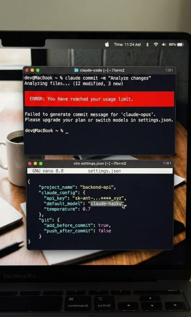

<div align="center">

# Claude Model Advisor

**Automatic model switching for Claude Code. No API calls, no config.**

[](LICENSE)




</div>

A Claude Code hook system that classifies every prompt by task complexity and switches your active model automatically. Sub-agent model rules are injected into every session so spawned agents also use the right tier.

## Features

- Classifies prompts by complexity using keyword and pattern matching (zero API calls)
- Auto-switches `settings.json` and injects a chat message on every tier mismatch
- Injects sub-agent model-selection rules into every session via `SessionStart`
- Prefix any prompt with `~` to bypass classification and keep the current model
- Logs every classification and switch to `~/.claude/hooks/model-advisor.log`

## How It Works

Two hook scripts run inside Claude Code:

**`session-init.sh`** (`SessionStart`) injects a `systemMessage` into every session that enforces these sub-agent rules:

| Tier | Use for |
|------|---------|
| `haiku` | Git ops, renames, formatting, file lookups, quick reads |
| `sonnet` | Feature work, debugging, writing/editing code, planning |
| `opus` | Architecture, deep multi-file analysis, complex refactors |

**`model-advisor.sh`** (`UserPromptSubmit`) classifies the incoming prompt, compares the recommended tier against the current model in `settings.json`, and switches if they do not match. The switch is reflected immediately in the current message.

## Installation

### One-liner

```bash
curl -fsSL https://raw.githubusercontent.com/tzachbon/claude-model-advisor/main/install.sh | bash
```

Then follow the printed instructions to update `~/.claude/settings.json`.

### Manual

```bash
git clone https://github.com/tzachbon/claude-model-advisor.git
cd claude-model-advisor
./install.sh
```

Or copy manually:

```bash
mkdir -p ~/.claude/hooks
cp hooks/session-init.sh hooks/model-advisor.sh ~/.claude/hooks/
chmod +x ~/.claude/hooks/session-init.sh ~/.claude/hooks/model-advisor.sh
```

### Update `~/.claude/settings.json`

Add to the `hooks` object (use the full absolute path from `echo $HOME`):

Under `SessionStart`:

```json
{
  "type": "command",
  "command": "/home/yourname/.claude/hooks/session-init.sh",
  "timeout": 2
}
```

Under `UserPromptSubmit`:

```json
"UserPromptSubmit": [
  {
    "matcher": "",
    "hooks": [
      {
        "type": "command",
        "command": "/home/yourname/.claude/hooks/model-advisor.sh",
        "timeout": 2
      }
    ]
  }
]
```

Then restart Claude Code.

## Override

Prefix any prompt with `~` to skip classification entirely and keep the current model active.

## Configuration

Settings are read from `~/.claude/settings.json`. The advisor writes the `model` field under `env` when switching tiers. No other files are modified.

## Log

Activity is written to `~/.claude/hooks/model-advisor.log`:

```
[2026-03-07 12:00:00] model=sonnet rec=opus action=AUTOSWITCH->opus prompt="analyze the entire..."
[2026-03-07 12:01:00] model=opus rec=match action=ALLOW prompt="git commit changes"
[2026-03-07 12:02:00] OVERRIDE prompt="~ keep opus for this..."
```

## Contributing

See [CONTRIBUTING.md](CONTRIBUTING.md).

## License

MIT. See [LICENSE](LICENSE).
