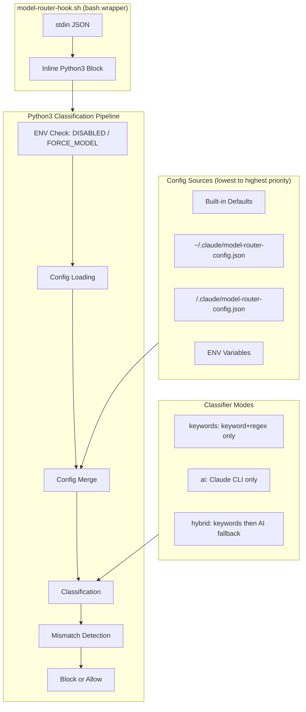
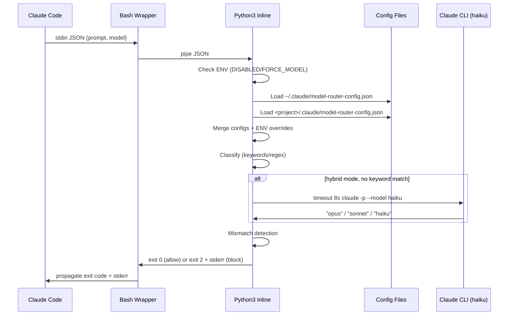

# Design: Extensible Model Router

## Overview

Extend the inline Python3 block in `model-router-hook.sh` with config file loading (global + per-project), additive keyword/pattern merging, ENV overrides, and AI classification fallback via Claude CLI. Single source of truth in `plugins/` with symlinks from `hooks/`. No new Python files.

## Architecture



## Components

### 1. ENV Early Exit

Handles `CLAUDE_ROUTER_DISABLED` and `CLAUDE_ROUTER_FORCE_MODEL` before any config loading.

```python
# Pseudocode insertion point: after prompt extraction, before model detection
disabled = os.environ.get("CLAUDE_ROUTER_DISABLED", "")
if disabled == "1":
    sys.exit(0)

force = os.environ.get("CLAUDE_ROUTER_FORCE_MODEL", "").lower()
if force in ("opus", "sonnet", "haiku"):
    recommendation = force  # skip classification entirely
```

### 2. Config Loader

Reads JSON from a path, returns dict. Errors produce stderr warning, return empty dict.

```python
def load_config(path):
    try:
        with open(os.path.expanduser(path), "r") as f:
            cfg = json.load(f)
        if not isinstance(cfg, dict):
            return {}
        return cfg
    except FileNotFoundError:
        return {}
    except Exception as e:
        print(f"model-router: warning: bad config {path}: {e}", file=sys.stderr)
        return {}
```

### 3. Config Merger

Combines two config dicts. Arrays are unioned with dedup, scalars are last-write-wins.

```python
def merge_config(base, override):
    result = dict(base)
    for key in ("classifier", "default_model"):
        if key in override:
            result[key] = override[key]
    for section in ("keywords", "patterns"):
        base_sec = result.get(section, {})
        over_sec = override.get(section, {})
        merged_sec = dict(base_sec)
        for tier in ("opus", "sonnet", "haiku"):
            base_list = base_sec.get(tier, [])
            over_list = over_sec.get(tier, [])
            merged_sec[tier] = list(dict.fromkeys(base_list + over_list))
        result[section] = merged_sec
    return result
```

### 4. Config Assembly

Full pipeline: built-in defaults -> global -> project -> ENV overrides.

```python
# Built-in defaults (current hardcoded values)
builtin = {
    "classifier": "keywords",
    "default_model": "sonnet",
    "keywords": {"opus": [...], "sonnet": [], "haiku": []},
    "patterns": {"opus": [], "sonnet": [...], "haiku": [...]}
}

# Layer configs
cfg = dict(builtin)
cfg = merge_config(cfg, load_config("~/.claude/model-router-config.json"))

project_root = None
try:
    import subprocess
    project_root = subprocess.check_output(
        ["git", "rev-parse", "--show-toplevel"],
        stderr=subprocess.DEVNULL
    ).decode().strip()
except Exception:
    pass

if project_root:
    cfg = merge_config(cfg, load_config(
        os.path.join(project_root, ".claude", "model-router-config.json")
    ))

# ENV overrides (highest priority)
env_classifier = os.environ.get("CLAUDE_ROUTER_CLASSIFIER", "")
if env_classifier in ("keywords", "ai", "hybrid"):
    cfg["classifier"] = env_classifier

env_extra = os.environ.get("CLAUDE_ROUTER_EXTRA_OPUS_KEYWORDS", "")
if env_extra:
    extras = [k.strip() for k in env_extra.split(",") if k.strip()]
    cfg["keywords"]["opus"] = list(dict.fromkeys(
        cfg["keywords"].get("opus", []) + extras
    ))
```

### 5. Classification Engine

Replaces current hardcoded classification with config-driven logic.

```python
def classify_keywords(prompt_lower, word_count, cfg):
    """Keyword + regex classification. Returns opus/sonnet/haiku/None."""
    opus_kw = cfg["keywords"].get("opus", [])
    opus_pat = cfg["patterns"].get("opus", [])

    # Opus: keywords OR patterns OR length heuristics
    has_opus_signal = any(kw in prompt_lower for kw in opus_kw)
    if not has_opus_signal:
        for p in opus_pat:
            try:
                if re.search(p, prompt_lower):
                    has_opus_signal = True
                    break
            except re.error:
                pass

    if has_opus_signal or (word_count > 100 and "?" in prompt_lower) or word_count > 200:
        return "opus"

    # Haiku: patterns (word_count < 60)
    haiku_pat = cfg["patterns"].get("haiku", [])
    haiku_kw = cfg["keywords"].get("haiku", [])
    if word_count < 60:
        haiku_match = any(kw in prompt_lower for kw in haiku_kw)
        if not haiku_match:
            for p in haiku_pat:
                try:
                    if re.search(p, prompt_lower):
                        haiku_match = True
                        break
                except re.error:
                    pass
        if haiku_match:
            return "haiku"

    # Sonnet: patterns
    sonnet_pat = cfg["patterns"].get("sonnet", [])
    sonnet_kw = cfg["keywords"].get("sonnet", [])
    sonnet_match = any(kw in prompt_lower for kw in sonnet_kw)
    if not sonnet_match:
        for p in sonnet_pat:
            try:
                if re.search(p, prompt_lower):
                    sonnet_match = True
                    break
            except re.error:
                pass
    if sonnet_match:
        return "sonnet"

    return None


def classify_ai(prompt):
    """AI classification via Claude CLI. Returns opus/sonnet/haiku."""
    import subprocess
    classification_prompt = (
        "Based on the following user prompt, classify which AI model tier should handle it. "
        "Reply with exactly one word: opus, sonnet, or haiku.\\n\\n"
        "- opus: complex reasoning, architecture, debugging hard problems, multi-file refactoring\\n"
        "- sonnet: moderate tasks, code generation, explanations, standard development\\n"
        "- haiku: simple questions, typo fixes, formatting, one-line changes, quick lookups\\n\\n"
        f"User prompt: {prompt[:500]}"
    )
    try:
        result = subprocess.run(
            ["timeout", "8s", "claude", "-p", "--model", "haiku", "--max-turns", "1",
             classification_prompt],
            capture_output=True, text=True, timeout=10
        )
        answer = result.stdout.strip().lower()
        if answer in ("opus", "sonnet", "haiku"):
            return answer
    except Exception:
        pass
    return "sonnet"  # fallback


# Main classification dispatcher
classifier_mode = cfg.get("classifier", "keywords")

if classifier_mode == "keywords":
    recommendation = classify_keywords(prompt_lower, word_count, cfg)
elif classifier_mode == "ai":
    recommendation = classify_ai(prompt)
elif classifier_mode == "hybrid":
    recommendation = classify_keywords(prompt_lower, word_count, cfg)
    if recommendation is None:
        recommendation = classify_ai(prompt)
else:
    recommendation = classify_keywords(prompt_lower, word_count, cfg)
```

## Data Flow



## Technical Decisions

| Decision | Options | Choice | Rationale |
|----------|---------|--------|-----------|
| Config format | YAML, TOML, JSON | JSON | Python3 stdlib, no deps, matches existing .claude patterns |
| Code location | New Python file, inline extension | Inline extension | Interview decision. Single bash script stays self-contained |
| Sync strategy | Copy files, git submodule, symlinks | Symlinks | Single source of truth in plugins/, hooks/ symlinks to it |
| AI classifier model | sonnet, haiku, opus | haiku | Cheapest/fastest, sufficient for tier classification |
| AI timeout | 5s, 8s, 10s | 8s | 2s buffer within 10s hook budget |
| Default classifier mode | keywords, hybrid | keywords | Backward compatible, no AI calls unless opted in |
| Merge algorithm | Replace, additive, deep merge | Additive arrays + last-write scalars | Users extend built-ins without replacing them |
| Opus pattern support | Keywords only, keywords+patterns | Keywords+patterns | Consistency across tiers (US-5) |
| Config error handling | Crash, silent ignore, warn+fallback | Warn+fallback | Never break the hook, but inform user of bad config |

## File Structure

| File | Action | Purpose |
|------|--------|---------|
| `plugins/claude-model-router-hook/hooks/model-router-hook.sh` | Modify | Source of truth. Add config loading, merging, ENV overrides, AI classification |
| `plugins/claude-model-router-hook/hooks/hooks.json` | Modify | Bump UserPromptSubmit timeout from 2 to 10 |
| `hooks/model-router-hook.sh` | Replace with symlink | Symlink -> `../plugins/claude-model-router-hook/hooks/model-router-hook.sh` |
| `hooks/hooks.json` | Modify | Bump UserPromptSubmit timeout from 2 to 10. Keep as regular file (hooks.json has different content per context due to `${CLAUDE_PLUGIN_ROOT}` vs relative paths) |
| `tests/test-model-router.sh` | Create | Test script for classification, config loading, merging, ENV overrides |

**Note on hooks.json**: The `hooks/hooks.json` cannot be a symlink because the standalone hooks use relative/direct paths while the plugin hooks use `${CLAUDE_PLUGIN_ROOT}`. Only `model-router-hook.sh` and `session-init.sh` can be symlinked.

## Symlink Details

```bash
# From repo root
cd hooks/
ln -sf ../plugins/claude-model-router-hook/hooks/model-router-hook.sh model-router-hook.sh
ln -sf ../plugins/claude-model-router-hook/hooks/session-init.sh session-init.sh
```

Both `hooks/hooks.json` files remain separate (different command paths) but both get timeout bumped to 10.

## Error Handling

| Error Scenario | Handling Strategy | User Impact |
|----------------|-------------------|-------------|
| Missing global config | `load_config` returns `{}`, silent | None, built-in defaults apply |
| Missing project config | `load_config` returns `{}`, silent | None |
| Malformed JSON in config | stderr warning, return `{}` | Warning printed, defaults apply |
| Invalid regex in config pattern | `re.error` caught, pattern skipped | Warning logged, other patterns still work |
| `git` not installed | `subprocess` exception caught, no project config | Global config + defaults apply |
| `claude` CLI not found (AI mode) | `subprocess` exception caught, return sonnet | Falls back to sonnet |
| AI classification timeout (8s) | `subprocess.run` timeout or exit 124 | Falls back to sonnet |
| AI returns invalid response | Not in opus/sonnet/haiku set | Falls back to sonnet |
| Unknown classifier mode in config | Treated as "keywords" | Keyword-only mode |
| Config has unknown fields | Ignored (`load_config` returns full dict) | Forward compatible |

## Edge Cases

- **Both keyword and AI match**: In hybrid mode, keyword result takes priority (AI only runs on no-match)
- **Empty prompt**: No keywords match, no AI call in keyword mode, recommendation=None, no block
- **Very long prompt**: Truncated to 500 chars for AI classification prompt only. Keyword matching uses full prompt
- **`~` prefix with FORCE_MODEL**: `~` bypass checked first (existing behavior), FORCE_MODEL never reached
- **FORCE_MODEL with matching model**: Sets recommendation but mismatch detection still compares, no block if model matches tier
- **Multiple tiers match keywords**: Opus checked first (highest priority), then haiku, then sonnet. Same priority order as current code

## Test Strategy

### Test Script: `tests/test-model-router.sh`

Bash script that creates temp config files, pipes JSON to the hook, asserts exit codes and stderr output.

### Unit-level Test Cases

| Category | Test | Input | Expected |
|----------|------|-------|----------|
| Classification | Opus keyword triggers opus | `{"prompt":"architect the system","model":"sonnet"}` | exit 2, stderr mentions opus |
| Classification | Sonnet pattern triggers sonnet | `{"prompt":"build the feature","model":"opus"}` | exit 2, stderr mentions sonnet |
| Classification | Haiku pattern triggers haiku | `{"prompt":"git commit","model":"opus"}` | exit 2, stderr mentions haiku |
| Classification | No match, no block | `{"prompt":"hello","model":"sonnet"}` | exit 0 |
| Classification | `~` prefix bypasses | `{"prompt":"~ architect it","model":"sonnet"}` | exit 0 |
| Config | Valid JSON parsed | Temp config with custom opus keyword | Custom keyword triggers opus |
| Config | Malformed JSON warns | Temp file with `{bad` | stderr warning, defaults apply |
| Config | Missing file silent | No config file | exit 0, no stderr warning |
| Config merge | Project overrides global scalar | Global classifier=keywords, project classifier=hybrid | Hybrid mode active |
| Config merge | Arrays merged additively | Global opus kw=["foo"], project opus kw=["bar"] | Both "foo" and "bar" match |
| Custom keywords | Config keyword triggers tier | Config adds "foobar" to opus keywords | Prompt with "foobar" -> opus |
| Custom patterns | Config regex triggers tier | Config adds `\\bxyz\\d+` to opus patterns | Prompt with "xyz123" -> opus |
| ENV | FORCE_MODEL bypasses | `CLAUDE_ROUTER_FORCE_MODEL=haiku` | Always recommends haiku |
| ENV | DISABLED exits immediately | `CLAUDE_ROUTER_DISABLED=1` | exit 0, no classification |
| ENV | EXTRA_OPUS_KEYWORDS | `CLAUDE_ROUTER_EXTRA_OPUS_KEYWORDS=myword` | "myword" triggers opus |
| Backward compat | No config = same behavior | No config files, no ENV | Same as current hook |

### Test Implementation Pattern

```bash
#!/bin/bash
# tests/test-model-router.sh
PASS=0; FAIL=0
HOOK="$(dirname "$0")/../plugins/claude-model-router-hook/hooks/model-router-hook.sh"

assert_exit() {
    local desc="$1" input="$2" expected_exit="$3"
    actual_exit=0
    echo "$input" | bash "$HOOK" >/dev/null 2>/dev/null || actual_exit=$?
    if [ "$actual_exit" -eq "$expected_exit" ]; then
        PASS=$((PASS+1))
    else
        FAIL=$((FAIL+1))
        echo "FAIL: $desc (expected exit $expected_exit, got $actual_exit)"
    fi
}
```

No AI mode tests (requires Claude CLI). All tests use keyword/regex mode with temp config files.

## Performance Considerations

- Config loading: 2 local file reads, negligible overhead (<5ms)
- `git rev-parse`: single subprocess call, fast (<50ms)
- Keyword-only mode: no regression from current, stays under 500ms
- AI mode: up to 8s for Claude CLI call, within 10s hook budget
- No caching needed for this iteration

## Security Considerations

- Config files are local filesystem only, no network fetching
- AI classification prompt contains only user prompt text (truncated), no file contents
- Pattern strings used in Python `re.search`, not shell, no injection risk
- Config values never interpolated into shell commands

## Existing Patterns to Follow

- Inline Python3 heredoc within bash (current pattern)
- `os.path.expanduser("~/.claude/...")` for home dir paths
- `try/except` with `pass` for non-critical failures
- Logging format: `[timestamp] key=value prompt="snippet..."`
- Exit 0 = allow, exit 2 = block with stderr message
- stderr for user-facing messages, log file for debug

## Implementation Steps

1. Create symlinks: `hooks/model-router-hook.sh` -> `../plugins/.../model-router-hook.sh`, same for `session-init.sh`
2. Bump timeout in both `hooks.json` files from 2 to 10
3. Extend Python3 block in `plugins/.../model-router-hook.sh`:
   a. Add `load_config()` and `merge_config()` functions
   b. Add config assembly pipeline (built-in -> global -> project -> ENV)
   c. Add ENV early exits (DISABLED, FORCE_MODEL)
   d. Add `classify_keywords()` function with config-driven keyword/pattern lists
   e. Add `classify_ai()` function with Claude CLI invocation
   f. Add classifier mode dispatcher (keywords/ai/hybrid)
   g. Add opus pattern support alongside existing keyword matching
   h. Add new log entries for config loaded and AI classification
4. Create `tests/test-model-router.sh` with all test cases
5. Verify backward compatibility: run tests with no config files
