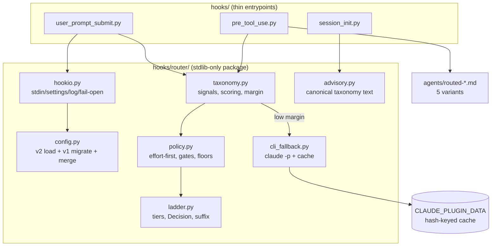
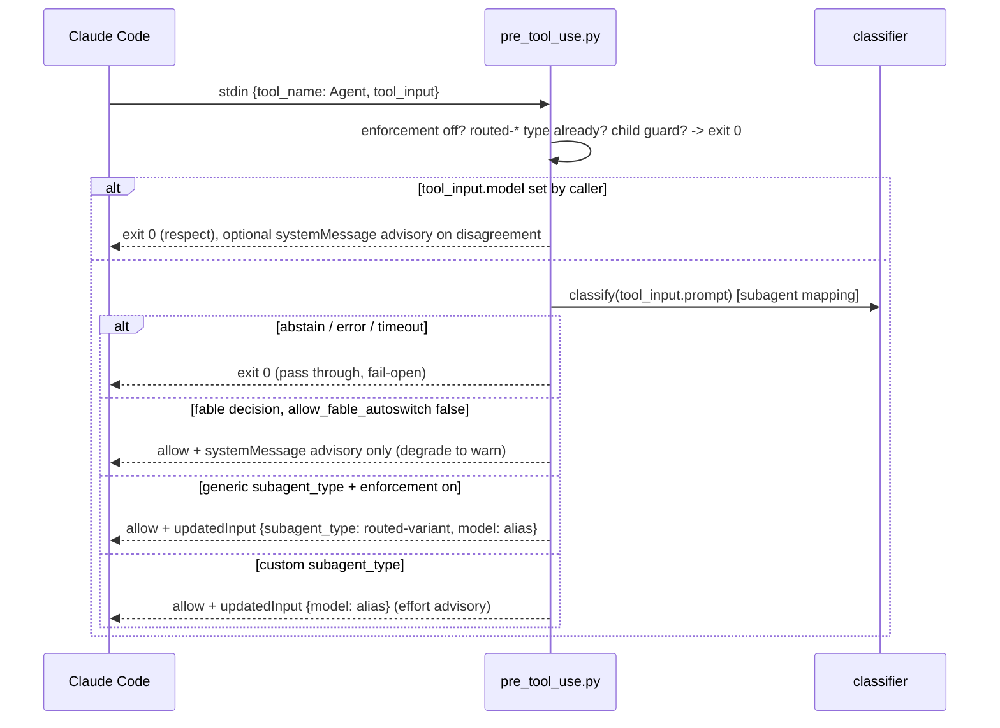

# Design: router-modernization (v2)

## Overview

Full rewrite of the hook logic into a stdlib-only Python package `router/` with three thin hook entrypoints (UserPromptSubmit, PreToolUse on Agent, SessionStart). A multi-signal scored taxonomy classifier emits (class, margin); an effort-first policy maps that to a (model, effort) pair relative to the current tier; low-margin cases fall back to a cached headless `claude -p --model haiku` call. Subagent spawns are enforced deterministically via PreToolUse `updatedInput`; main-prompt routing stays advisory (warn) with opt-in settings-level autoswitch.

## Assumption Resolutions (A-1..A-6, evidence first)

| # | Resolution | Evidence |
|---|---|---|
| A-1 | Agent tool `model` accepts family aliases (`haiku/sonnet/opus/fable`), full model IDs, and `inherit`. Router emits ALIASES only: this session's live Agent tool schema shows enum exactly `["sonnet","opus","haiku","fable"]`, so aliases are the safe intersection between doc claim and observed schema; aliases also let the platform resolve plan-specific IDs. | code.claude.com/docs model-config "Restrict model selection", sub-agents "Choose a model"; live tool schema in Claude Code 2.1.212 |
| A-2 | Default effort is `high` on Fable 5 / Sonnet 5 / Opus 4.8 (xhigh only on Opus 4.7, not on our ladder). Persisted in `effortLevel` key of settings.json (values low/medium/high/xhigh; `max` is session-only). Design assumes current effort = `effortLevel` setting if present, else `high`. | model-config "Adjust effort level"; empirical: this machine's `~/.claude/settings.json` contains `"effortLevel": "medium"` set via /effort |
| A-3 | Multi-hook `permissionDecision` precedence: deny > defer > ask > allow. `updatedInput` merge across multiple hooks is UNDOCUMENTED. Design: always return `allow` (never fights a deny); accept that another plugin's updatedInput collision is undefined platform behavior; our output is idempotent (re-running it yields same input) so ordering races are benign. Documented as a known limitation in README. | hooks docs "PreToolUse decision control"; gap confirmed by docs sweep |
| A-4 | Hook env inheritance is undocumented, but hook commands are child processes and practically inherit env. `CLAUDE_CODE_SUBAGENT_MODEL` outranks per-invocation `model` (docs: overrides model param AND frontmatter), so injection is silently dead when it is set. Design: best-effort `os.environ` check; if set and it differs from decision, emit `systemMessage` warning. If env not visible, no warning, no harm (fail-safe). | env-vars + model-config docs; precedence: env > tool param > frontmatter > inherit |
| A-5 | Only PreToolUse (and PermissionRequest) support `updatedInput`. UserPromptSubmit explicitly CANNOT replace the prompt or touch model/effort; its full output surface is `decision:"block"` + `reason`, `hookSpecificOutput.additionalContext`, `systemMessage`, `suppressOutput`/`continue`. Confirms: main-prompt path is advisory-only; self-managed CLI subprocess is required for the LLM fallback. | hooks docs "Modifying tool input" |
| A-6 | Model for NEW sessions: `model` key in settings files; precedence managed > `ANTHROPIC_MODEL` env > `.claude/settings.local.json` > `.claude/settings.json` > `~/.claude/settings.json`. Mid-session, a settings.json change requires restart or `/model`. Effort equivalent: `effortLevel` key (low/medium/high/xhigh only). Autoswitch therefore writes `model` + `effortLevel` to `~/.claude/settings.json` atomically, effective for new sessions; live session gets the advisory message. `max` clamps to `xhigh` on write. | settings docs "Scope Priority", model-config "Setting your model"; empirical: both keys present in local settings.json |

### Measured CLI latency (this machine, Claude Code 2.1.212)

| Prompt | Runs (wall s) | Mean / Max |
|---|---|---|
| `claude -p "reply with one word: ok" --model haiku` | 2.13, 1.99, 2.19, 1.83, 2.14 | 2.06 / 2.19 |
| Same, realistic classifier prompt (class-word reply) | 4.23, 4.37, 4.41, 5.47 | 4.62 / 5.47 |

CLI process overhead alone (user+sys) ~0.85s. No distinct cold-start spike observed across 9 runs.

**Timeout budget (FR-29, NFR-2), derived from max observed 5.47s:**

| Knob | Value | Rationale |
|---|---|---|
| CLI subprocess timeout (`classifier.cli_timeout_seconds`) | 8s | 1.45x max observed classifier call; bounded worst case |
| UserPromptSubmit hook timeout | 10s | 8s CLI + heuristics (<200ms) + interpreter startup + margin; under the 30s event cap |
| PreToolUse hook timeout | 10s | Same path |
| SessionStart hook timeout | 5s | No CLI call; python startup only (v1 used 2s for bash) |

## Architecture



### Data flow: UserPromptSubmit path

```mermaid
sequenceDiagram
    participant U as User
    participant H as user_prompt_submit.py
    participant C as classifier (taxonomy+policy)
    participant F as cli_fallback
    U->>H: stdin {prompt}
    H->>H: bypass? "<" or "~" prefix, child-env guard -> exit 0
    H->>H: read model+effortLevel (env>local>project>user, default effort high)
    H->>C: classify(prompt, config)
    C->>C: score classes, margin
    alt margin < threshold and fallback enabled
        C->>F: cache lookup by sha256(prompt)
        F-->>C: cached class | claude -p (8s timeout) | heuristic decision (fail-open)
    end
    C->>H: (model, effort) | abstain
    alt abstain or match
        H-->>U: exit 0
    else warn mode, mismatch
        H-->>U: exit 2, stderr "/model X + /effort Y, resend"
    else autoswitch, mismatch
        H->>H: atomic write model/effortLevel to ~/.claude/settings.json (fable gated)
        H-->>U: exit 2, stderr "default updated for new sessions; /model X to apply now"
    end
```

### Data flow: PreToolUse Agent path



## Components (`plugins/claude-model-router-hook/hooks/router/`)

### ladder.py
Handles: tier constants, decision type, model-string utilities. Covers FR-1, FR-2, FR-3, FR-6.
```python
TIERS = ("haiku", "sonnet", "opus", "fable")          # index = rank; mythos nowhere
MODEL_IDS = {"haiku": "claude-haiku-4-5", "sonnet": "claude-sonnet-5",
             "opus": "claude-opus-4-8", "fable": "claude-fable-5"}
EFFORTS = ("low", "medium", "high", "xhigh", "max")
@dataclass(frozen=True)
class Decision:
    model: str            # alias from TIERS
    effort: str | None    # None iff model == "haiku" (enforced in __post_init__)
    klass: str
    source: str           # "heuristic" | "cli" | "cache"
def detect_tier(model_str: str) -> str | None      # substring match incl. "fable"
def split_suffix(model_str: str) -> tuple[str, str]  # ("opus", "[1m]")
def effort_distance(a: str, b: str) -> int
```
`Decision.__post_init__` raises on `effort is not None and model == "haiku"`, on non-ladder model, and asserts `"mythos" not in model` (FR-2 belt and braces; test-asserted).

### config.py
Handles: defaults, v2 load, structural v1 detection, in-memory migration, layered merge. Covers FR-30..FR-34, NFR-8.
```python
def load_config(global_path=None, cwd=None) -> dict          # merged v2-shaped dict
def detect_version(raw: dict) -> int                         # 2 if version==2; 1 if legacy keys; else 2 (defaults)
def migrate_v1(raw: dict) -> dict                            # pure, never writes files
def merge(base: dict, overlay: dict) -> dict                 # v1 semantics: per-key, dict spread, $schema skipped; classes merged per class
def resolve_list(class_cfg, field, defaults) -> list         # extend/replace/remove_* (v1 function preserved)
def v1_hint_due(data_dir) -> bool                            # marker file in CLAUDE_PLUGIN_DATA
```
Each file (global, project) is version-detected and migrated independently, then merged with v1 semantics (project wins). Unparseable file -> `{}` (fail-open, AC-8.5).

### taxonomy.py
Handles: signal extraction, per-class scoring, margin confidence, extremity escalation. Covers FR-7, FR-19, FR-23, FR-24.
```python
CLASSES = ("mechanical", "implementation", "debugging", "architecture", "extreme")  # + implicit abstain
def score(prompt: str, cfg: dict) -> ScoreResult   # {scores: dict[class,float], top, second, margin, word_count}
def classify_heuristic(prompt: str, cfg: dict) -> tuple[str | None, ScoreResult]
    # returns (class|None-abstain, evidence); ALWAYS decides alone (FR-24):
    # margin >= confident_margin and top >= 3 -> top; else if top_score >= 2 -> top (low-confidence); else abstain
```

### policy.py
Handles: effort-first mapping, asymmetric thresholds, capability gates, effort floors, class targets. Covers FR-4, FR-5, FR-20, FR-21, FR-22.
```python
def target_for_class(klass: str, cfg: dict) -> Decision            # subagent/fresh-context mapping
def main_prompt_decision(klass, current_model, current_effort, cfg, score) -> Decision | None
def apply_gates(prompt, decision, cfg) -> Decision
    # capability_gates patterns -> min tier sonnet; class floors (debugging) +
    # effort_floors patterns -> effort >= floor; any floor implies min tier sonnet (haiku carries no effort)
```

### cli_fallback.py
Handles: tier-2 LLM classification, cache. Covers FR-25..FR-28, NFR-5, NFR-9.
```python
def classify_cli(prompt: str, cfg: dict, data_dir: str | None) -> str | None
    # cache lookup -> subprocess claude -p -> parse -> cache store; None on any failure
```

### hookio.py
Handles: fail-open wrapper, stdin parse, settings resolution, logging, output builders. Covers FR-35..FR-37, NFR-3, NFR-5.
```python
def fail_open(fn)                            # decorator: any exception -> sys.exit(0)
def read_event() -> dict                     # malformed -> exit 0
def current_model_effort() -> tuple[str, str]  # env > settings.local > project > user; effort default "high" (A-2/A-6)
def log(action: str, prompt: str, **kv)      # 30-char snippet max (v1 invariant)
def emit_pretooluse(updated_input=None, system_message=None)  # permissionDecision "allow" JSON
def bypassed(prompt) -> bool                 # "<" / "~" prefixes; "~" logged OVERRIDE
def is_child() -> bool                       # CLAUDE_MODEL_ROUTER_CHILD env guard
```

### advisory.py
Handles: single canonical taxonomy/advisory text. Covers FR-17, FR-42.
```python
ADVISORY_MD: str                              # canonical taxonomy table (markdown)
def render_session_context(current_model) -> str
```
`scripts/sync_docs.py` injects `ADVISORY_MD` between `<!-- advisory:start/end -->` markers in README.md and both prompt.md files; `--check` mode fails CI on drift (FR-42/43, AC-11.1).

### Entrypoints (thin, no logic beyond wiring)
| File | Event | Behavior |
|---|---|---|
| `hooks/user_prompt_submit.py` | UserPromptSubmit | Flow above; exit 0/2 |
| `hooks/pre_tool_use.py` | PreToolUse, matcher `Agent\|Task` | Flow above; stdout JSON |
| `hooks/session_init.py` | SessionStart | Emits `additionalContext` from advisory.py |

v1 bash wrappers (`model-router-hook.sh`, `session-init.sh`) and `model_router.py` are deleted; hooks.json invokes `python3 "${CLAUDE_PLUGIN_ROOT}/hooks/<entrypoint>.py"` directly (same python3 dependency v1 already had, one fewer indirection).

## Taxonomy Design

### Classes, signals, weights

Signal contributions are additive per class; every signal type is capped so no single signal can force a tier (FR-7, pitfall: confounder inputs).

| Class | Text signals (defaults; config-extendable per class) | Structural/length signals | Cap per signal type |
|---|---|---|---|
| mechanical | v1 haiku patterns (git ops, rename, format, lint, move/delete file, version bump) | word_count <= mechanical_max_words required (else class score zeroed); short imperative (<=12 words) +1 | text +6 (hits x2), length +1 |
| implementation | v1 sonnet patterns (build/implement/create/fix/write/component/api/test...) | code-fence present +1 | text +6, structure +1 |
| debugging | debug, why is X failing, flaky, race, regression, stack trace, `error:`, traceback, exit code, bisect, reproduce | error/traceback text block +2 | text +6, structure +2 |
| architecture | v1 opus keywords (architect, tradeoff, redesign, deep dive, strategy...) + opus patterns | word_count >= long_prompt_words +1, >= 2x +2; "?" with word_count >= question_words +1 | text +6, length +2 (hard cap, FR-7) |
| extreme (escalation of architecture) | multi-system, migration plan, across the entire codebase, long-horizon, RFC/design doc, epic, rewrite the platform | only evaluated when architecture is top class; each marker +1 | +3; escalates when extremity >= 2 |

Scoring: keyword/pattern hit = +2 (config lists via `resolve_list`, v1 extend/replace/remove_* semantics). `margin = score(top) - score(second)`.

### Confidence and decision ladder

| Condition | Outcome |
|---|---|
| margin >= confident_margin (3) and top >= 3 | heuristic decision final (no CLI) |
| below threshold, fallback enabled | cache -> CLI tiebreak -> class |
| fallback disabled/missing/timeout | top class if top >= 2 else abstain (FR-24, AC-7.4) |
| empty/whitespace prompt | abstain |

Asymmetric thresholds (FR-5): any decision that LOWERS tier (vs current tier on main prompts; to haiku on subagents) additionally requires margin >= downroute_margin (4) and no capability-gate hit. Up-routes need only the standard confidence.

### Capability gates and effort floors

| Rule | Trigger | Effect |
|---|---|---|
| Handoff gate (FR-21, AC-6.3) | prompt matches SendMessage / handoff / coordinate agents / spawn subagents / multi-agent patterns | min tier sonnet; mechanical->haiku decision bumped to (sonnet, medium) |
| Debugging floor (FR-22, AC-6.5) | class = debugging | effort >= high |
| Data-handling floor (FR-22) | prompt matches migration / database / prod / delete data / backfill (shipped defaults of `effort_floors.patterns`) | effort >= `effort_floors.floor` (high); min tier sonnet |

### (model, effort) output matrix

Class targets (used verbatim for subagent spawns; config-overridable via `classes.<name>.target`):

| Class | Target | Agent variant |
|---|---|---|
| mechanical | (haiku, no effort) | routed-haiku |
| implementation | (sonnet, medium) | routed-sonnet-medium |
| debugging | (sonnet, high) | routed-sonnet-high |
| architecture | (opus, high) | routed-opus-high |
| extreme | (fable, high) | routed-fable-high |
| abstain | pass through unmodified | none |

Main-prompt effort-first matrix (current tier x class -> suggestion; "stay" = no tier change, AC-2.1):

| Class \ current | haiku | sonnet | opus | fable |
|---|---|---|---|---|
| mechanical | match (no-op) | haiku (downroute guard) | haiku (guard) | haiku (guard) |
| implementation | sonnet medium (capability up-route) | stay, medium | stay, medium | stay, medium |
| debugging | sonnet high | stay, high | stay, high | stay, high |
| architecture | opus high | opus high | stay, xhigh | stay, high |
| extreme | fable high | fable high | fable high | stay, xhigh |

The xhigh cells (architecture@opus, extreme@fable) exceed their class targets deliberately: the session is already on the target tier, so only effort can escalate further (effort-first).

Effort-only mismatches warn only when `effort_distance >= effort_warn_distance` (default 2): kills nagging (high->medium is silent) while catching the dangerous cases (/effort low + debugging -> warn to high). Tier mismatches always warn. Haiku decisions never carry effort (AC-2.4; `Decision` invariant). Intentional v1 semantic change: haiku session + implementation/debugging now up-routes to sonnet (v1 refused haiku->sonnet; capability-wrong, test updated, documented in CHANGELOG).

### Requirements Amendments

Deviations reconciled into requirements.md (minimal wording edits, numbering preserved):

| Req | Amendment |
|---|---|
| AC-1.1 / AC-1.2 | "Match" redefined: tier equal AND `effort_distance < effort_warn_distance` (default 2). Tier mismatch always warns; effort-only gaps below the distance are silent (anti-nagging). |
| FR-16 / AC-4.2 | Variant coverage scoped to DEFAULT taxonomy (model, effort) cells. Config-overridden class targets without a shipped variant degrade to model-only injection, effort advisory. |
| FR-6 | Suffix preservation (`[1m]`) applies to warn suggestions and autoswitch settings writes only. Injected subagent models cannot carry suffixes: the Agent tool `model` enum is alias-only (A-1). |

## Config Schema v2

```jsonc
{
  "$schema": "https://.../model-router.schema.json",
  "version": 2,                              // discriminator (required for v2 shape)
  "apply_mode": "warn",                      // "warn" | "autoswitch"
  "allow_fable_autoswitch": false,
  "subagent_enforcement": "on",              // "on" | "advisory" | "off"; independent of apply_mode
  "classifier": {
    "cli_fallback": true,
    "cli_timeout_seconds": 8,
    "cache_max_entries": 1000
  },
  "thresholds": {
    "confident_margin": 3,
    "downroute_margin": 4,
    "effort_warn_distance": 2,
    "mechanical_max_words": 60,              // from v1 haiku_max_word_count
    "long_prompt_words": 200,                // from v1 opus_word_count
    "question_words": 100                    // from v1 opus_question_word_count
  },
  "classes": {                               // each class: v1 tierConfig shape + target
    "mechanical":     { "mode": "extend", "keywords": [], "patterns": [], "remove_keywords": [], "remove_patterns": [], "target": { "model": "haiku" } },
    "implementation": { "target": { "model": "sonnet", "effort": "medium" } },
    "debugging":      { "target": { "model": "sonnet", "effort": "high" } },
    "architecture":   { "target": { "model": "opus",   "effort": "high" } },
    "extreme":        { "target": { "model": "fable",  "effort": "high" } }
  },
  "capability_gates": { "mode": "extend", "patterns": [], "remove_patterns": [] },   // effect: min tier sonnet
  "effort_floors":    { "mode": "extend", "patterns": [], "remove_patterns": [], "floor": "high" }  // ships data-handling defaults; effect: effort >= floor (implies min tier sonnet)
}
```

Schema file: single `schema/model-router.schema.json` becomes `oneOf: [v1-shape, v2-shape]` (v2 branch requires `"version": 2`; both branches keep `additionalProperties: false`, FR-34). v1 users' `$schema` pointers keep validating.

### v1 detection + in-memory migration (FR-31, FR-32)

Detection: `version` key absent AND any of `{opus, sonnet, haiku, thresholds}` present -> v1. Empty/absent config -> v2 defaults, no hint.

| v1 key | v2 mapping |
|---|---|
| `opus.{mode,keywords,patterns,remove_*}` | `classes.architecture.*` |
| `sonnet.{...}` | `classes.implementation.*` |
| `haiku.{...}` | `classes.mechanical.*` |
| `thresholds.opus_word_count` | `thresholds.long_prompt_words` |
| `thresholds.opus_question_word_count` | `thresholds.question_words` |
| `thresholds.haiku_max_word_count` | `thresholds.mechanical_max_words` |
| (implicit warn-only v1) | `apply_mode: "warn"`, other v2 keys = defaults |

One-time hint: marker file `${CLAUDE_PLUGIN_DATA}/v1-hint-shown`; when due, hint line appended to the warn stderr (exit-2 path) or emitted as `systemMessage` (exit-0 path). User files never written (AC-8.2/8.3).

## Plugin-Shipped Agent Variants (FR-16)

`plugins/claude-model-router-hook/agents/` (referenced in `updatedInput.subagent_type`). The rewrite uses the plugin-scoped name `claude-model-router-hook:<name>` only when the shipped agent file exists under `CLAUDE_PLUGIN_ROOT` (a plugin install); for manual installs the bare `routed-*` name is emitted so it resolves against `~/.claude/agents` (matches `pre_tool_use.py`):

| File | Frontmatter | Used for |
|---|---|---|
| `routed-haiku.md` | `name: routed-haiku`, `model: haiku` (NO effort key) | mechanical |
| `routed-sonnet-medium.md` | `model: sonnet`, `effort: medium` | implementation |
| `routed-sonnet-high.md` | `model: sonnet`, `effort: high` | debugging |
| `routed-opus-high.md` | `model: opus`, `effort: high` | architecture |
| `routed-fable-high.md` | `model: fable`, `effort: high` | extreme (only when `allow_fable_autoswitch: true`) |

Body: identical minimal general-purpose text ("Complete the delegated task exactly as prompted; return a concise report"), `tools: "*"` equivalent omitted (defaults to all). Descriptions state they are router-managed variants. If a config-overridden class target has no matching variant, the hook degrades to model-injection only (effort advisory); a unit test asserts every DEFAULT target has a shipped variant (AC-4.2). `updatedInput` also injects `model` alias alongside the rewrite (belt and braces; model param outranks frontmatter with the same value).

## PreToolUse Contract Details

- hooks.json entry: matcher `"Agent|Task"` (alias tolerated, FR-12), timeout 10.
- Generic spawn detection: `subagent_type` in `{"general-purpose", "default", "claude"}` or absent/empty (FR-14).
- Idempotency guard: `subagent_type` already `claude-model-router-hook:routed-*` -> exit 0.
- Explicit caller model param present -> NO injection (locked decision 4); if router disagrees, `systemMessage` one-liner advisory.
- `CLAUDE_CODE_SUBAGENT_MODEL` present in env and != decision -> append warning to systemMessage (A-4).
- Output shape: `{"hookSpecificOutput": {"hookEventName": "PreToolUse", "permissionDecision": "allow", "updatedInput": {...}}}`. Never deny (FR-13). Any exception -> exit 0 (FR-18).
- Suffix note (FR-6): suffix tags like `[1m]` are preserved in warn suggestions and settings writes only; injected `model` values are bare aliases because the Agent tool model enum is alias-only (A-1).
- `subagent_enforcement`: `on` = rewrite+inject; `advisory` = systemMessage only, no updatedInput; `off` = exit 0 immediately.

## CLI Fallback Design (FR-25..FR-28)

Prompt template (truncated to first 1500 chars of the user prompt; that same classified snippet, not the full prompt, is hashed for the cache key):

```
Classify this coding-assistant request into exactly one class.
mechanical: git ops, renames, formatting, trivial single-step edits
implementation: writing or modifying code/features/tests, routine work
debugging: diagnosing failures, flaky tests, errors, regressions
architecture: design decisions, tradeoffs, deep multi-file analysis
extreme: architecture-scale, multi-system, long-horizon work
abstain: cannot tell / needs more info
Reply with ONLY the class word.
Request:
"""
{snippet}
"""
```

- Invocation: `subprocess.run(["claude", "-p", template, "--model", "haiku"], timeout=cfg.cli_timeout_seconds, env={**os.environ, "CLAUDE_MODEL_ROUTER_CHILD": "1"})`. The env guard makes all our hooks in the child headless session exit 0 immediately (recursion protection; headless mode runs hooks).
- Parse: strip/lower first token; must be in CLASSES + abstain, else discard (fail-open to heuristic).
- Fail-open ladder (AC-7.4): CLI missing (FileNotFoundError) / non-zero exit / timeout / garbage output -> return None -> heuristic low-confidence decision applies.
- Cache (`${CLAUDE_PLUGIN_DATA}/classifier-cache.json`): `{sha256(taxonomy_rev + snippet).hexdigest()[:32]: {"c": class, "t": epoch}}` where `snippet` is the classified `prompt[:1500]` sent to the model, so the key can never drift from the payload. Stores hash + class only, never prompt text (NFR-5). Max `cache_max_entries` (1000); on overflow evict oldest 20%. Corrupt/unreadable -> discard and rewrite (NFR-9). Writes via tempfile + `os.replace` (atomic). `CLAUDE_PLUGIN_DATA` unset -> skip caching entirely (still functional).
- Disable knob: `classifier.cli_fallback: false` -> heuristics-only, fully offline (AC-7.6, NFR-7).

## Autoswitch Design (FR-9..FR-11, from A-6)

- `apply_mode: "autoswitch"` main-prompt path on tier/effort mismatch:
  1. Fable decision and `allow_fable_autoswitch: false` -> behave exactly like warn (FR-11).
  2. Read `~/.claude/settings.json`; unparseable -> degrade to warn (never risk clobbering).
  3. Write `model` = suggested alias + preserved suffix (e.g. `opus[1m]`), `effortLevel` = effort clamped to xhigh (settings rejects max; haiku decision removes/omits effortLevel write and writes model only). Atomic tempfile + `os.replace`; all other keys preserved.
  4. Exit 2 with: `Router set default to <model> (effort <e>) for new sessions. Run /model <model> to apply now, then resend. (~ to skip)` (AC-3.2: never claims live switch).
- Detection caveat surfaced in message when `ANTHROPIC_MODEL` env or a project settings file defines `model` (higher precedence would mask the write, per A-6 precedence chain).
- Subagent enforcement is NOT part of apply_mode: it runs under `subagent_enforcement` (default on) in both warn and autoswitch (AC-3.4), except fable injection which requires `allow_fable_autoswitch`.

## Eval Harness (FR-38, FR-39)

- `tests/eval/eval_set.jsonl`, one object per line:
  `{"id": "dbg-014", "prompt": "...", "expected_class": "debugging", "expected": {"model": "sonnet", "effort": "high"}, "tags": ["flaky-test"]}` (abstain rows: `"expected_class": "abstain"`). 50-100 rows, >= 8 per class incl. adversarial/degenerate rows (huge mechanical prompts, keyword-stuffed trivia).
- `tests/eval/run_eval.py`: imports `router.taxonomy` + `router.policy` directly (real entry point, AC-10.2/10.4), runs with `cli_fallback: false` (deterministic in CI, NFR-10), prints per-class accuracy, confusion matrix, tier distribution. Exits 1 if:
  - class accuracy < `ACCURACY_MIN` (provisional 0.90)
  - fable share of non-abstain decisions > `FABLE_SHARE_MAX` (provisional 0.10)
  - opus+fable share > `TOP_SHARE_MAX` (provisional 0.40)
  - heuristic classify p95 wall time over the eval set >= 200ms (NFR-1 verification)
- Thresholds are constants at the top of run_eval.py with a comment: finalize after the baseline run (an implementation task runs the baseline, records numbers + rationale in CHANGELOG/commit).
- CI: new step in `.github/workflows/test.yml` after unit/integration; plus `python3 scripts/sync_docs.py --check` (docs parity gate, AC-11.1).

## Error Handling (fail-open enumeration, NFR-3)

| Failure | Path | Behavior |
|---|---|---|
| Malformed stdin JSON | all hooks | exit 0 (FR-37) |
| Prompt starts `<` / `~` | UserPromptSubmit | exit 0; `~` logged OVERRIDE (FR-35/36) |
| settings.json unreadable / model key absent/unknown | UserPromptSubmit | exit 0 (v1 parity) |
| Config file unparseable | all | that layer -> `{}`, built-in defaults (AC-8.5) |
| Invalid user regex | classifier | pattern skipped silently (`safe_regex_match` preserved) |
| CLI binary missing / exit != 0 / timeout / unparseable reply | cli_fallback | None -> heuristic decision (FR-27) |
| Cache corrupt / unwritable / CLAUDE_PLUGIN_DATA unset | cli_fallback | ignore cache, continue (NFR-9) |
| Settings write failure (autoswitch) | UserPromptSubmit | degrade to warn message |
| Missing `tool_input.prompt` / unexpected tool payload | PreToolUse | exit 0 pass-through (FR-18) |
| Any uncaught exception | all entrypoints | `fail_open` decorator -> exit 0 |
| CLAUDE_MODEL_ROUTER_CHILD set | all entrypoints | exit 0 (recursion guard) |

## File Structure

| File | Action | Purpose |
|---|---|---|
| `plugins/.../hooks/router/{__init__,ladder,config,taxonomy,policy,cli_fallback,hookio,advisory}.py` | Create (8) | Core package |
| `plugins/.../hooks/{user_prompt_submit,pre_tool_use,session_init}.py` | Create (3) | Entrypoints |
| `plugins/.../agents/routed-{haiku,sonnet-medium,sonnet-high,opus-high,fable-high}.md` | Create (5) | Effort-carrying variants |
| `tests/test_router.py` | Create | Unit tests importing real modules (replaces inline `_classify`) |
| `tests/eval/eval_set.jsonl`, `tests/eval/run_eval.py` | Create (2) | CI eval gate |
| `scripts/sync_docs.py` | Create | Advisory-text generation + `--check` parity |
| `plugins/.../hooks/hooks.json` | Modify | Add PreToolUse (`Agent\|Task`, 10s), timeouts 10/10/5, python3 direct invocation |
| `schema/model-router.schema.json` | Modify | `oneOf` v1/v2, `additionalProperties: false` kept |
| `tests/test_config.py` | Modify | Import `router.config`; drop `_classify` (FR-40) |
| `tests/test-hook.sh` | Modify | v1 suites kept (haiku->sonnet case updated); + fable, effort message, PreToolUse rewrite suites (FR-41) |
| `.github/workflows/test.yml` | Modify | + eval gate, + sync_docs --check |
| `README.md`, `prompt.md`, `plugins/.../prompt.md` | Modify | v2 behavior, marker-generated advisory block, CLI-fallback disclosure replacing "No API calls" (FR-44); prompt.md becomes clone+install instructions, not inline scripts |
| `install.sh` (root) | Modify | Becomes delegation to `plugins/.../install.sh` (dedup, FR-43) |
| `plugins/.../install.sh` | Modify | Copies package+agents+schema, prints PreToolUse registration incl. agents dir (FR-46) |
| `.claude-plugin/plugin.json`, `plugins/.../.claude-plugin/plugin.json`, `.claude-plugin/marketplace.json` | Modify (3) | 2.0.0 (FR-45) |
| `CHANGELOG.md` | Modify | Backfill 1.0.1/1.1.0/1.3.0 from git log; add 2.0.0 (FR-45) |
| `docs/slides/slides.md` | Modify | Correct behavior claims only (FR-44) |
| `plugins/.../hooks/model_router.py`, `model-router-hook.sh`, `session-init.sh` | Delete (3) | Replaced by package + entrypoints |

## Test Strategy

- **Unit (`tests/test_router.py`, real imports)**: ladder invariants (haiku-no-effort, mythos exclusion, suffix split); config v1 detection/migration table, merge, extend/replace/remove; taxonomy scoring/margin/caps per class; policy matrix (all 20 cells), gates, floors, downroute guard; cli_fallback parse + fail-open with mocked `subprocess.run`; cache eviction/corruption; effort_warn_distance.
- **Integration (`tests/test-hook.sh` extended)**: v1 suites 1-8 preserved (suite-1 haiku->sonnet expectation flipped, documented); new suites: fable suggestion on extreme prompt, effort suggestion in stderr, `[1m]` suffix preserved with effort, PreToolUse generic rewrite (assert updatedInput JSON), custom-type model-only injection, explicit-model respect, abstain pass-through, CLAUDE_MODEL_ROUTER_CHILD guard, autoswitch settings write (fake HOME) + fable gating. CLI fallback forced off via config in all shell tests.
- **Eval gate**: as above; heuristics-only, deterministic.
- **Docs parity**: `sync_docs.py --check` in CI; unit test asserts default class targets each have a shipped agent variant file.

## Technical Decisions

| Decision | Options | Choice | Rationale |
|---|---|---|---|
| Model format in updatedInput | aliases / full IDs / both | aliases | Live tool schema enum is aliases-only (A-1); docs allow both, aliases are the safe intersection |
| Effort enforcement channel | advisory only / rewrite subagent_type / new param | hybrid rewrite (locked) with 5 default-matrix variants + graceful degradation for overridden targets | Full model x effort matrix = 16+ files; defaults cover every emittable cell, overrides degrade to model-only |
| CLI recursion protection | none / lockfile / env guard | `CLAUDE_MODEL_ROUTER_CHILD=1` env | Headless `claude -p` runs hooks; env guard is 1 line per entrypoint, also excludes child noise from logs/cache |
| CLI timeout / hook timeouts | 2s (v1) / 5s / 8s+10s | 8s subprocess, 10s hooks | Max observed classifier call 5.47s; 2s (v1) provably kills every fallback; 10s < 30s event cap |
| Bash wrappers | keep / delete | delete, python3 direct | Wrapper only relayed exit codes; python3 dependency unchanged |
| Schema versioning | new file / replace / oneOf | single file, `oneOf` v1+v2 | v1 `$schema` pointers keep working; `additionalProperties:false` kept per branch |
| Docs single source | generate all / parity test only | canonical constant in advisory.py + marker-block generation + CI `--check` | Generation removes drift class entirely; check mode keeps CI-enforceable |
| install.sh dedup | parity test / delegation | root delegates to plugin copy | One real script; zero drift surface |
| haiku->sonnet up-route (v1 refused) | preserve / change | change (up-route) | Capability-wrong to keep implementation on haiku; documented semantic change, test updated |
| Effort-warn noise control | warn on any mismatch / distance >= 2 | distance >= 2 (configurable) | Default effort high + implementation target medium would nag every prompt; distance 2 catches only correctness-critical gaps |
| Cache scope | per-prompt exact hash | sha256(taxonomy_rev + prompt) | Invalidates on taxonomy changes; no fuzzy matching complexity |
| Settings write target | user settings / project / settings.local | `~/.claude/settings.json` | v1 precedent; lowest precedence = least surprising; higher-precedence masks are detected and disclosed |

## Traceability: FR Coverage

| FRs | Component |
|---|---|
| FR-1, FR-2, FR-3, FR-6 | ladder.py (Decision invariants, tiers, suffix) |
| FR-4, FR-5, FR-20, FR-21, FR-22 | policy.py (matrix, asymmetric guard, targets, gates, floors) |
| FR-7, FR-19, FR-23, FR-24 | taxonomy.py (caps, classes, scoring, standalone decision) |
| FR-8 | user_prompt_submit.py warn path |
| FR-9, FR-10, FR-11 | user_prompt_submit.py autoswitch path + settings writer (hookio) |
| FR-12, FR-13, FR-14, FR-15, FR-18 | pre_tool_use.py + hooks.json matcher |
| FR-16 | agents/routed-*.md (5 variants) |
| FR-17 | session_init.py + advisory.py |
| FR-25, FR-26, FR-27, FR-28 | cli_fallback.py (+ classifier.cli_fallback flag in config.py) |
| FR-29 | hooks.json timeouts (10/10/5, budget table above) |
| FR-30, FR-31, FR-32, FR-33 | config.py (v2 schema, detection, migration, hint, merge) |
| FR-34 | schema/model-router.schema.json oneOf |
| FR-35, FR-36, FR-37 | hookio.py bypasses + fail_open |
| FR-38, FR-39 | tests/eval/{eval_set.jsonl, run_eval.py} + test.yml |
| FR-40 | tests/test_router.py + test_config.py refactor |
| FR-41 | tests/test-hook.sh new suites |
| FR-42, FR-43 | advisory.py + scripts/sync_docs.py + install.sh delegation |
| FR-44 | README.md / prompt.md / slides.md edits |
| FR-45 | 3 manifests + CHANGELOG.md |
| FR-46 | plugins/.../install.sh + hooks.json |

## Unresolved Questions

- Multi-hook `updatedInput` merge order (A-3) is undocumented platform behavior; design is idempotent-output + documented limitation, nothing further actionable.
- Eval thresholds (0.90 / 0.10 / 0.40) are provisional until the baseline eval run during implementation.

## Implementation Steps

1. Create `router/` package: ladder.py, hookio.py, config.py (with v1 migration), taxonomy.py, policy.py, cli_fallback.py, advisory.py.
2. Create entrypoints user_prompt_submit.py, pre_tool_use.py, session_init.py; delete model_router.py and both bash hook scripts.
3. Create 5 `agents/routed-*.md` variants; update hooks.json (PreToolUse matcher `Agent|Task`, timeouts 10/10/5, python3 direct).
4. Update schema to oneOf v1/v2.
5. Write tests/test_router.py (real imports), refactor test_config.py, extend test-hook.sh (fable/effort/PreToolUse/autoswitch suites).
6. Build tests/eval/eval_set.jsonl (50-100 labeled) + run_eval.py; run baseline; lock thresholds.
7. Create advisory.py canonical text + scripts/sync_docs.py; regenerate README/prompt.md blocks; rewrite prompt.md as clone+install doc; delegate root install.sh; update plugin install.sh for agents/schema/PreToolUse.
8. Wire CI: eval gate + sync_docs --check in test.yml.
9. Bump 3 manifests to 2.0.0; backfill CHANGELOG (1.0.1, 1.1.0, 1.3.0, 2.0.0); correct slides claims.
